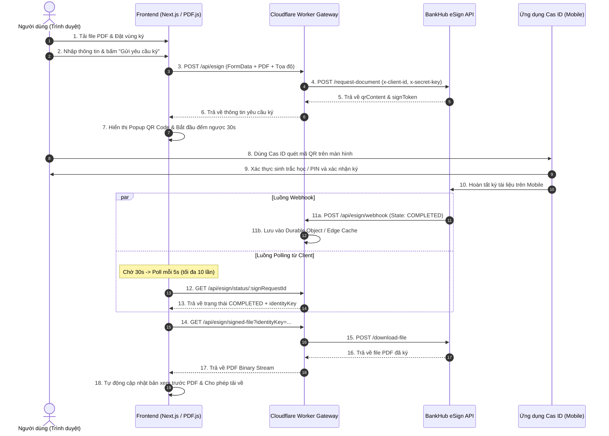

# TÀI LIỆU TỔNG HỢP HỆ THỐNG CAS SIGN: APIS, CƠ CHẾ HOẠT ĐỘNG & TRA CỨU CHỮ KÝ

---

## MỤC LỤC
1. [Giới thiệu tổng quan hệ thống](#1-giới-thiệu-tổng-quan-hệ-thống)
2. [Kiến trúc kỹ thuật & Công nghệ sử dụng](#2-kiến-trúc-kỹ-thuật--công-nghệ-sử-dụng)
3. [Tổng hợp danh sách các API](#3-tổng-hợp-danh-sách-các-api)
   - [3.1. API Gửi yêu cầu ký tài liệu (Push Sign Request)](#31-api-gửi-yêu-cầu-ký-tài-liệu-push-sign-request)
   - [3.2. API Kiểm tra trạng thái yêu cầu ký (Check Sign Status)](#32-api-kiểm-tra-trạng-thái-yêu-cầu-ký-check-sign-status)
   - [3.3. API Webhook nhận thông báo kết quả ký (Webhook Callback)](#33-api-webhook-nhận-thông-báo-kết-quả-ký-webhook-callback)
   - [3.4. API Tải file PDF đã ký (Download Signed File)](#34-api-tải-file-pdf-đã-ký-download-signed-file)
   - [3.5. API Tra cứu thông tin chữ ký & chứng thư số (Signing Round Lookup)](#35-api-tra-cứu-thông-tin-chữ-ký--chứng-thư-số-signing-round-lookup)
   - [3.6. API Stream trạng thái thời gian thực (SSE Stream)](#36-api-stream-trạng-thái-thời-gian-thực-sse-stream)
4. [Cơ chế hoạt động chi tiết](#4-cơ-chế-hoạt-động-chi-tiết)
   - [4.1. Quy trình ký tài liệu điện tử (Signing Flow)](#41-quy-trình-ký-tài-liệu-điện-tử-signing-flow)
   - [4.2. Cơ chế Polling thông minh & Đồng bộ trạng thái Webhook](#42-cơ-chế-polling-thông-minh--đồng-bộ-trạng-thái-webhook)
   - [4.3. Cơ chế Lưu trữ & Phục hồi phiên làm việc (Session Persistence)](#43-cơ-chế-lưu-trữ--phục-hồi-phiên-làm-việc-session-persistence)
   - [4.4. Cơ chế Xử lý & Chuẩn hóa tọa độ chữ ký PDF](#44-cơ-chế-xử-lý--chuẩn-hóa-tọa-độ-chữ-ký-pdf)
5. [Trang tra cứu & Kiểm tra thông tin ID chữ ký (`/lookup`)](#5-trang-tra-cứu--kiểm-tra-thông-tin-id-chữ-ký-lookup)
   - [5.1. Mục đích & Vai trò](#51-mục-đích--vai-trò)
   - [5.2. Định dạng mã tra cứu `orgIdSigned`](#52-định-dạng-mã-tra-cứu-orgidsigned)
   - [5.3. Cấu trúc dữ liệu chi tiết trả về](#53-cấu-trúc-dữ-liệu-chi-tiết-trả-về)
   - [5.4. Giao diện trực quan hóa thông tin chứng thư số](#54-giao-diện-trực-quan-hóa-thông-tin-chứng-thư-số)
6. [Cấu hình môi trường & Triển khai](#6-cấu-hình-môi-trường--triển-khai)

---

## 1. Giới thiệu tổng quan hệ thống

**CAS Sign** là giải pháp ký số và xác thực tài liệu điện tử từ xa (Remote Signing) tích hợp với nền tảng **BankHub eSign** và ứng dụng di động **Cas ID**.

Hệ thống cho phép:
- Người dùng tải lên tài liệu PDF, thiết lập các vị trí ký trực quan (kéo thả, đổi kích thước, phân trang).
- Tạo yêu cầu ký điện tử với thông tin cá nhân hoặc doanh nghiệp (Mã số thuế).
- Sinh mã QR động để người ký quét và ký số trực tiếp trên ứng dụng Cas ID.
- Tự động theo dõi trạng thái ký qua cơ chế kết hợp Webhook và Polling thông minh.
- Xem trước trực tiếp và tải về file PDF đã được đóng dấu chữ ký số đạt chuẩn.
- Tra cứu lịch sử vòng ký (`orgIdSigned`), xác minh tính pháp lý, tính toàn vẹn của văn bản, chứng thư số (CA) và thông tin thiết bị thực hiện ký.

---

## 2. Kiến trúc kỹ thuật & Công nghệ sử dụng

```
┌─────────────────────────────────────────────────────────────────────────────┐
│                            CLIENT (TRÌNH DUYỆT)                              │
│  - Next.js App Router (React 19, TypeScript, Lucide Icons)                  │
│  - Render PDF: PDF.js (pdfjs-dist)                                          │
│  - Quản lý phiên: IndexedDB (CasSignDB / current_session)                   │
│  - Sinh mã QR: qrcode library (DataURL Modal)                               │
└───────────────────────┬─────────────────────────────────────────────────────┘
                        │ HTTP / REST / SSE
                        ▼
┌─────────────────────────────────────────────────────────────────────────────┐
│                   CLOUDFLARE WORKER GATEWAY & PROXY                         │
│  - Entrypoint: worker/index.ts (Vinext Server Runtime)                      │
│  - Bảo mật Credentials: x-client-id, x-secret-key bảo vệ phía Server        │
│  - Caching & Persistence: Cloudflare Cache API & Durable Object (SIGN_STATUS│
│  - Bộ giải mã PDF: Hỗ trợ trích xuất Base64 hoặc luồng Binary Stream       │
└───────────────────────┬─────────────────────────────────────────────────────┘
                        │ API Call (mã hóa HTTPS)
                        ▼
┌─────────────────────────────────────────────────────────────────────────────┐
│                  HỆ THỐNG NGOÀI (BANKHUB & CAS ID)                          │
│  - BankHub eSign Core API Gateway (Sandbox / Production)                    │
│  - S3 Storage lưu trữ file đã ký (CMC Telecom Cloud)                       │
│  - Ứng dụng di động Cas ID (Xác thực sinh trắc học / OTP / SmartCA)         │
└─────────────────────────────────────────────────────────────────────────────┘
```

---

## 3. Tổng hợp danh sách các API

Hệ thống cung cấp và tích hợp các API sau:

### 3.1. API Gửi yêu cầu ký tài liệu (Push Sign Request)

- **Đường dẫn**: `POST /api/esign`
- **Mô tả**: Tiếp nhận file PDF, thông tin người ký và danh sách tọa độ các khung ký từ client, sau đó đính kèm thông tin xác thực (`x-client-id`, `x-secret-key`) và forward lên BankHub upstream (`/push-request-document` hoặc `/request-document`).
- **Định dạng dữ liệu**: `multipart/form-data`

#### Danh sách tham số Form-Data:
| Tên trường | Kiểu dữ liệu | Bắt buộc | Mô tả |
| :--- | :--- | :---: | :--- |
| `signRequestId` | `string` | **Có** | Mã định danh yêu cầu ký, được sinh từ client theo chuẩn `CAS-<TIMESTAMP>-<RANDOM>` (Ví dụ: `CAS-M4Z1K8-9A8B7C6D`). |
| `file` | `File (Binary)` | **Có** | File tài liệu định dạng PDF, dung lượng tối đa 20 MB. |
| `documentName` | `string` | **Có** | Tên tài liệu cần ký (độ dài 10 - 200 ký tự, đã lọc ký tự điều khiển). |
| `organizationName` | `string` | **Có** | Tên đơn vị gửi yêu cầu ký (Mặc định: `"Cas Sign"`). |
| `identificationNumber`| `string` | Không | Số CCCD/CMND của người ký (tùy chọn, không bắt buộc). |
| `taxCode` | `string` | Điều kiện | Mã số thuế doanh nghiệp (Bắt buộc nếu bật chế độ Ký doanh nghiệp, gồm 10 số hoặc 10 số-3 số). |
| `signatureFields` | `string (JSON)` | **Có** | Danh sách tọa độ vùng ký được mã hóa JSON (Xem chi tiết mục 4.4). |

#### Phản hồi mẫu thành công (HTTP 200):
```json
{
  "requestId": "CAS-M4Z1K8-9A8B7C6D",
  "pushSignRequestDocument": {
    "signRequestId": "CAS-M4Z1K8-9A8B7C6D",
    "qrContent": "https://id.cas.vn/sign?token=eyJhbGciOi...",
    "qrCodeUrl": "https://id.cas.vn/sign?token=eyJhbGciOi...",
    "signToken": "948201",
    "expiresIn": 900,
    "state": "PENDING"
  }
}
```

---

### 3.2. API Kiểm tra trạng thái yêu cầu ký (Check Sign Status)

- **Đường dẫn**: `GET /api/esign/status/:signRequestId`
- **Mô tả**: Kiểm tra trạng thái hiện tại của phiên ký theo `signRequestId`.
- **Cơ chế hoạt động**:
  1. Kiểm tra cache trong **Durable Object** hoặc **Cloudflare Cache API**. Nếu đã lưu trạng thái cuối (`COMPLETED` hoặc `REJECTED`), trả về ngay lập tức với nguồn `requestId: "webhook-state"`.
  2. Nếu chưa có, Worker gọi API BankHub upstream `POST ${apiBase}/request-status` với body `{"signRequestId": "..."}`.
  3. Khi nhận trạng thái `COMPLETED` hoặc `REJECTED` từ BankHub, Worker tự động lưu vào Cache / Durable Object qua `ctx.waitUntil(...)` để tăng tốc cho các lần đọc tiếp theo.

#### Phản hồi mẫu khi hoàn tất ký (HTTP 200):
```json
{
  "requestId": "upstream-api",
  "signRequestStatus": {
    "signRequestId": "CAS-M4Z1K8-9A8B7C6D",
    "state": "COMPLETED",
    "identityKey": "id_key_signed_998124_pdf",
    "signedFileUrl": "https://s3.hn-2.cloud.cmctelecom.vn/cas-bucket/signed_doc.pdf",
    "identityKeyExpiresAt": "2026-09-10T12:00:00Z",
    "expiresIn": 604800,
    "lastUpdatedAt": "2026-09-03T08:50:12.345Z"
  }
}
```

---

### 3.3. API Webhook nhận thông báo kết quả ký (Webhook Callback)

- **Đường dẫn**: `/api/esign/webhook`
- **Phương thức hỗ trợ**: `POST` (Nhận dữ liệu), `GET` (Kiểm tra hoạt động), `HEAD` (Health check), `OPTIONS` (CORS).
- **Cơ chế xác thực (Bảo mật)**:
  - Yêu cầu truyền `token` trùng khớp với biến môi trường `ESIGN_WEBHOOK_SECRET`.
  - Hỗ trợ truyền qua Query: `?token=<SECRET>` hoặc Headers: `x-webhook-token`, `x-token`, `Authorization: Bearer <SECRET>`.
- **URL đăng ký với đối tác BankHub**:
  ```text
  https://cas-sign.<domain-cua-ban>.workers.dev/api/esign/webhook?token=<ESIGN_WEBHOOK_SECRET>
  ```

#### Payload mẫu từ BankHub gửi về (POST):
```json
{
  "signRequest": {
    "signRequestId": "CAS-M4Z1K8-9A8B7C6D",
    "state": "COMPLETED",
    "identityKey": "id_key_signed_998124_pdf",
    "signedFileUrl": "https://s3.hn-2.cloud.cmctelecom.vn/cas-bucket/signed_doc.pdf",
    "rejectedReason": null,
    "expiresIn": 604800
  }
}
```

---

### 3.4. API Tải file PDF đã ký (Download Signed File)

- **Đường dẫn**: `GET /api/esign/signed-file` hoặc `POST /api/esign/signed-file`
- **Tham số**:
  - `identityKey` *(Ưu tiên)*: Mã định danh file đã ký do BankHub cấp.
  - `url` *(Fallback)*: Đường dẫn tải trực tiếp từ CMC Telecom S3 Cloud.
- **Xử lý phía Worker**:
  - Tự động kiểm tra bộ nhớ đệm Cache API (`https://sign-status.internal/pdf/${identityKey}`).
  - Nếu chưa có, Worker gửi request `POST ${apiBase}/download-file` kèm `identityKey`.
  - Hỗ trợ trích xuất linh hoạt: Nhận trực tiếp luồng binary `application/pdf` hoặc tự động bóc tách chuỗi `Base64` từ phản hồi JSON/Text, sau đó chuyển đổi thành `Uint8Array`.
  - Cache file PDF với thời hạn 24 giờ (`max-age=86400`) và trả về `Content-Type: application/pdf`.

---

### 3.5. API Tra cứu thông tin chữ ký & chứng thư số (Signing Round Lookup)

- **Đường dẫn**: `GET /api/esign/signing-round` hoặc `GET /api/esign/signing-round/:orgIdSigned`
- **Tham số Query**:
  - `orgIdSigned` *(Bắt buộc)*: Mã định danh vòng ký (ví dụ: `kysoqr.com#vpl2z_`).
  - `language`: Ngôn ngữ thông tin trả về (`vi` hoặc `en`, mặc định: `vi`).
- **Worker xử lý**: Gọi upstream `GET ${apiBase}/signing-round/${orgIdSigned}` với header `x-client-id`, `x-secret-key`, `language`.

#### Cấu trúc phản hồi đầy đủ (HTTP 200):
```json
{
  "requestId": "REQ-LOOKUP-9921",
  "signingRound": {
    "authMethod": "Xác thực mã PIN trên Cas ID",
    "signedAt": "15:30:22 03/09/2026",
    "device": {
      "model": "iPhone 15 Pro Max (iOS 18.2)"
    },
    "signer": {
      "displayName": "NGUYỄN VĂN A"
    },
    "certificate": {
      "issuer": {
        "commonName": "VNPT-CA",
        "organization": "TẬP ĐOÀN BƯU CHÍNH VIỄN THÔNG VIỆT NAM",
        "country": "VN"
      },
      "signer": {
        "commonName": "NGUYỄN VĂN A",
        "taxOrCitizenId": "001200001234",
        "country": "VN"
      },
      "documentIntegrity": "Tài liệu không bị chỉnh sửa sau khi ký",
      "signatureValidity": "Chữ ký hợp lệ tại thời điểm ký",
      "hasTimestamp": "Có (Timestamp Token chuẩn RFC 3161)",
      "validFrom": "2025-01-01 00:00:00",
      "validTo": "2027-01-01 23:59:59",
      "signedAtLong": "2026-09-03T15:30:22.000+07:00"
    }
  }
}
```

---

### 3.6. API Stream trạng thái thời gian thực (SSE Stream)

- **Đường dẫn**: `GET /api/esign/stream/:signRequestId`
- **Mô tả**: Hỗ trợ Server-Sent Events kết nối trực tiếp đến Cloudflare Durable Object (`SignStatusStore`) để nhận push trạng thái ngay khi có cập nhật mà không cần HTTP request lặp lại.

---

## 4. Cơ chế hoạt động chi tiết

### 4.1. Quy trình ký tài liệu điện tử (Signing Flow)



---

### 4.2. Cơ chế Polling thông minh & Đồng bộ trạng thái Webhook

Để tối ưu hóa trải nghiệm người dùng, hạn chế request rác lên máy chủ và đảm bảo độ trễ thấp nhất:

1. **Giai đoạn 1 — Chờ khởi tạo (Initial 30s Cooldown)**:
   - Khi gửi yêu cầu ký thành công, hệ thống không gọi API kiểm tra ngay mà hiển thị thanh tiến trình đếm ngược 30 giây (`pollPhase: "initial_wait"`).
   - Khoảng thời gian này giúp người dùng có đủ thời gian mở điện thoại, khởi chạy ứng dụng Cas ID và quét mã QR.
2. **Giai đoạn 2 — Polling tích cực (Active Polling)**:
   - Sau khi hết 30 giây, hệ thống bắt đầu kiểm tra trạng thái mỗi 5 giây một lần.
   - Số lần kiểm tra tự động tối đa là 10 lần (tổng thời gian 50 giây tiếp theo).
3. **Giai đoạn 3 — Dừng tự động & Chuyển sang Cập nhật thủ công (Manual Fallback)**:
   - Nếu sau 10 lần mà người dùng vẫn chưa hoàn thành việc ký, hệ thống dừng tự động gửi request để tiết kiệm tài nguyên.
   - Cung cấp nút **"Cập nhật trạng thái thủ công"** để người dùng bấm kiểm tra bất kỳ lúc nào.
4. **Đồng bộ hóa với Webhook phía Server**:
   - Ngay khi BankHub kích hoạt Webhook về Worker, trạng thái `COMPLETED` sẽ được lưu vào Cache.
   - Bất kỳ request kiểm tra nào từ Client sau thời điểm đó sẽ trả về kết quả thành công ngay lập tức mà không cần gọi thêm sang BankHub.

---

### 4.3. Cơ chế Lưu trữ & Phục hồi phiên làm việc (Session Persistence)

- Ứng dụng tích hợp **IndexedDB** (`CasSignDB`, object store: `sessionStore`, key: `current_session`) chạy ngầm trên trình duyệt.
- Tự động lưu trữ:
  - Dữ liệu biểu mẫu (Tên tài liệu, Gửi từ, CCCD, Mã số thuế).
  - Trạng thái ký doanh nghiệp.
  - Toàn bộ nội dung binary của file PDF (`fileBuffer`).
  - Danh sách tọa độ các khung ký (`fields`).
  - Trạng thái phiên ký (`activeRequestId`, `qrContent`, `signToken`, `qrUrl`, `status`).
- **Lợi ích**: Khi người dùng vô tình tải lại trang (F5), chuyển trang hoặc mất kết nối tạm thời, toàn bộ trạng thái làm việc, tài liệu và mã QR đang chờ ký sẽ được khôi phục nguyên vẹn 100%.

---

### 4.4. Cơ chế Xử lý & Chuẩn hóa tọa độ chữ ký PDF

Hệ tọa độ hiển thị trên web (gốc tọa độ ở góc trên bên trái canvas) khác với hệ tọa độ chuẩn của file PDF (gốc tọa độ `(0,0)` nằm ở góc dưới bên trái trang).

Frontend thực hiện chuyển đổi tỷ lệ chuẩn hóa (tỷ lệ từ `0.0` đến `1.0`) trước khi gửi lên API:

$$\text{yRatio}_{\text{PDF}} = \max\left(0, \min\left(1, 1 - \text{yRatio}_{\text{Web}} - \text{heightRatio}\right)\right)$$

Cấu trúc đối tượng chữ ký gửi đi:
```json
[
  {
    "page": 1,
    "xRatio": 0.52,
    "yRatio": 0.18,
    "widthRatio": 0.34,
    "heightRatio": 0.1,
    "fieldType": "SIGNATURE"
  }
]
```

---

## 5. Trang tra cứu & Kiểm tra thông tin ID chữ ký (`/lookup`)

Trang tra cứu được xây dựng tại đường dẫn: `https://<domain>/lookup` (hoặc truy cập qua tab **"Tra cứu chữ ký"** trên thanh điều hướng đầu trang).

### 5.1. Mục đích & Vai trò
- Cho phép bất kỳ ai (khách hàng, đối tác, kiểm toán viên) kiểm tra và thẩm định tính pháp lý của một tài liệu đã được ký điện tử thông qua hệ thống Cas Sign.
- Xác thực xem chữ ký có bị giả mạo, văn bản có bị chỉnh sửa trái phép sau khi ký hay không.
- Xem chi tiết danh tính người ký, đơn vị chứng thực số (CA) và thiết bị thực hiện ký.

---

### 5.2. Định dạng mã tra cứu `orgIdSigned`
- Mã vòng ký có cấu trúc: `<tên_tổ_chức>#<id_chữ_ký>`
- Ví dụ thực tế: `kysoqr.com#vpl2z_`
- Người dùng chỉ cần nhập mã này vào ô tìm kiếm hoặc bấm vào nút mẫu thử nghiệm nhanh có sẵn trên màn hình.

---

### 5.3. Cấu trúc dữ liệu chi tiết trả về

Dữ liệu trả về từ API `/api/esign/signing-round` được phân nhóm thành các khối thông tin logic:

```text
SigningRoundData
├── requestId (Mã yêu cầu tra cứu)
└── signingRound
    ├── authMethod (Phương thức xác thực: PIN, Biometrics, SmartCA...)
    ├── signedAt (Thời gian ký dạng chuỗi dễ đọc)
    ├── device
    │   └── model (Tên và model thiết bị di động đã thực hiện ký)
    ├── signer
    │   └── displayName (Tên hiển thị của người ký)
    └── certificate
        ├── issuer (Đơn vị chứng thực chữ ký số - CA)
        │   ├── commonName (Tên nhà cung cấp CA: VNPT-CA, Viettel-CA, BKAV-CA...)
        │   ├── organization (Tổ chức quản lý CA)
        │   └── country (Quốc gia cấp phép)
        ├── signer (Thông tin chủ thể trên chứng thư)
        │   ├── commonName (Họ và tên đầy đủ trên chứng thư số)
        │   ├── taxOrCitizenId (Số CCCD hoặc Mã số thuế doanh nghiệp)
        │   └── country (Quốc gia)
        ├── documentIntegrity (Đánh giá tính toàn vẹn văn bản)
        ├── signatureValidity (Tính hợp lệ của chữ ký tại thời điểm ký)
        ├── hasTimestamp (Dấu thời gian Timestamp RFC 3161)
        ├── validFrom (Thời điểm bắt đầu hiệu lực của chứng thư)
        ├── validTo (Thời điểm hết hiệu lực của chứng thư)
        └── signedAtLong (Thời gian ký chuẩn ISO 8601 kèm múi giờ)
```

---

### 5.4. Giao diện trực quan hóa thông tin chứng thư số

Trang `/lookup` hiển thị các thành phần trực quan:

1. **Banner Xác thực Tổng quan (Result Banner)**:
   - Huy hiệu chứng nhận hợp lệ (`signatureValidity`).
   - Các nhãn Meta: Thời gian ký (`Clock`), Tính toàn vẹn văn bản (`ShieldAlert`), Dấu thời gian kiểm chứng (`Fingerprint`).
2. **Khối Thông tin Người ký (Signer Info Card)**:
   - Tên hiển thị người ký.
   - Họ tên đầy đủ trên chứng thư số.
   - Số định danh CCCD / Mã số thuế.
   - Phương thức xác thực (Mã PIN trên Cas ID).
   - Thiết bị ký (Tên thiết bị và hệ điều hành).
3. **Khối Chứng thư số & Đơn vị cấp CA (Certificate & CA Card)**:
   - Nhà cung cấp dịch vụ CA (ví dụ: VNPT-CA).
   - Tổ chức chứng thực.
   - Hiệu lực chứng thư (`validFrom` → `validTo`).
   - Trạng thái toàn vẹn của tệp tài liệu.
4. **Khối Trình xem JSON Gốc (Raw JSON Inspector)**:
   - Cho phép mở rộng để xem trực tiếp cấu trúc JSON kỹ thuật.
   - Tích hợp nút **"Sao chép JSON"** hỗ trợ lập trình viên kiểm thử và đối soát hệ thống.

---

## 6. Cấu hình môi trường & Triển khai

### 6.1. Danh sách biến môi trường (Environment Variables)

| Tên biến | Bắt buộc | Môi trường áp dụng | Ý nghĩa |
| :--- | :---: | :--- | :--- |
| `ESIGN_CLIENT_ID` | **Có** | Worker Secret / `.env` | Client ID được BankHub cấp cho ứng dụng. |
| `ESIGN_SECRET_KEY` | **Có** | Worker Secret / `.env` | Secret Key dùng để ký và xác thực các cuộc gọi API. |
| `ESIGN_API_URL` | Không | Worker Secret / `.env` | Endpoint API BankHub (Sandbox: `https://sandbox.bankhub.dev/esign/request-document`, Prod: `https://production.bankhub.dev/esign/push-request-document`). |
| `ESIGN_WEBHOOK_SECRET`| **Có** | Worker Secret / `.env` | Chuỗi bí mật ngẫu nhiên dùng để bảo mật Webhook callback. |
| `CLOUDFLARE_API_TOKEN`| **Có** | GitHub Actions Secret | Token cấp quyền triển khai Cloudflare Workers. |
| `CLOUDFLARE_ACCOUNT_ID`| **Có** | GitHub Actions Secret | Account ID của tài khoản Cloudflare. |

### 6.2. Triển khai tự động qua GitHub Actions
Khi có commit đẩy lên nhánh `main`, quy trình `.github/workflows/deploy.yml` sẽ tự động:
1. Cài đặt dependencies và build dự án với `vinext`.
2. Deploy mã nguồn lên Cloudflare Worker với tên service `cas-sign`.
3. Tự động đồng bộ các biến secrets được mã hóa lên Cloudflare Worker qua lệnh `wrangler secret bulk`.
